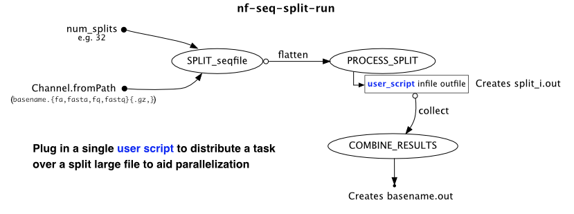

## split-run-nf



Split a fastq file (using `seqkit split2`), run a user-provided script in bin/, and join output.

This pipeline is built around the task of splitting fastq files for parallel processing, as some tools (such as trf) do not natively support parallelization. 
However, many tasks can be distributed into different processes by dividing the source data. This pipeline accomplishes that.

### Requirements

* nextflow
* seqkit
* Your script's dependencies

### Add your script
A script for running trf and processing the output is currently provided as an example. Replace those (or simply add) your custom script to the bin/ directory.
The script must take two arguments like so:

```
user-script input_file output_file
```

* user-script must be placed in the bin directory and executable
* it must take an input file name and output file name, although it may produce any number of files as intermediates, they won't be retained (without modifying main.nf).
* Run locally with ` nextflow run main.nf --input_fastq sample.fastq --num_splits 4 --outdir results`
* Run on slurm using `sbatch submit_pipeline.sh file.fastq`
